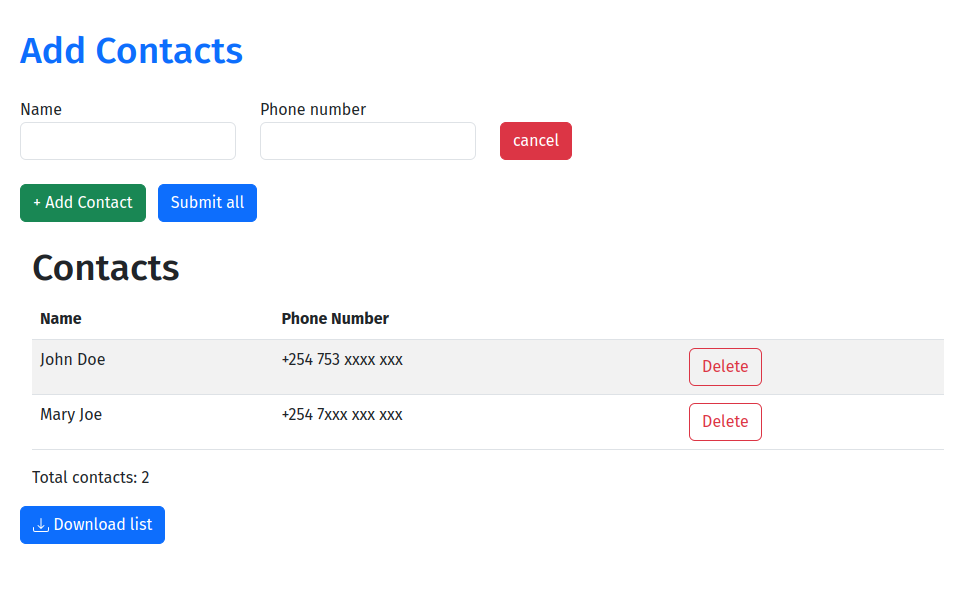

# Django + htmx Example: A Contact Management App 😎📇

Welcome to our Contact Management application built with Django and the amazing HTMX library! With HTMX, we can harness modern browser features directly from HTML, making our app super interactive without the need for excessive JavaScript. 🚀🌟

## What is HTMX? 🤔
HTMX is a powerful library that enables us to enhance user experience by interacting with the server and updating the DOM using simple HTML attributes. It saves us from writing tons of JavaScript code and allows us to focus on making our app more delightful. 😍🎉

## Prerequisites ⚙️
Before diving into this  app, make sure you have Django and HTMX properly installed. Check the [htmx documentation](https://htmx.org/docs/) to get started with HTMX. 💻🔧

## Let's Get Started! 🚀

### base.html - The Foundation of Our App 🏛️

Our base template sets the stage for all the  interactions:

```html
...
<body hx-headers='{"X-CSRFTOKEN": "{{ csrf_token }}"}'>
    <div class="container mt-5">
        
        
    </div>
</body>
...
```

### form.html - A Form to add Contacts 📝

Here's our form for adding  contacts. It's so easy to use :

```html
<form hx-post=""
 hx-target="#contact-list" hx-swap="beforeend" 
hx-on="htmx:afterRequest: this.remove()"
hx-trigger="click from:#submit-all"
>
    <div class="row">
        <div class="col-4 col-md-3">
            <label for="{{ form.name.id_for_label }}">{{ form.name.label }}</label>
            {{ form.name }} 
        </div>
        <div class="col-4 col-md-3">
            <label for="{{ form.phone_number.id_for_label }}">{{ form.phone_number.label }}</label>
            {{ form.phone_number }} 
        </div>
        <div class="col-3 align-self-end">
            <button type="button" class="btn btn-danger"
            hx-on="click: this.closest('form').remove()"
            > Cancel</button>
        </div>
    </div>
</form>
```

### contact.html - A  Table of Contacts 📊

Behold, the table of your contacts! It's simple and inviting, just like a delightful gathering of friends:

```html
<tr class="contact-row">
    <td>{{ contact.name }}</td>
    <td>{{ contact.phone_number }}</td>
    <td>
        <button type="button" class="btn btn-outline-danger delete-contact"
        hx-delete="/" 
        hx-target="#contact-list"
        hx-confirm="Are you sure you wish to delete?"> Delete</button>
    </td>
</tr>
```

### And there you have it! 🎉🥳


Now you have a Contact Management app th. Thanks to Django and HTMX, we can build interactive and delightful applications without drowning in excessive JavaScript.

Feel free to extend and customize this app further ! 😄🌈

Have fun and keep the joy alive! 🎉🤗
